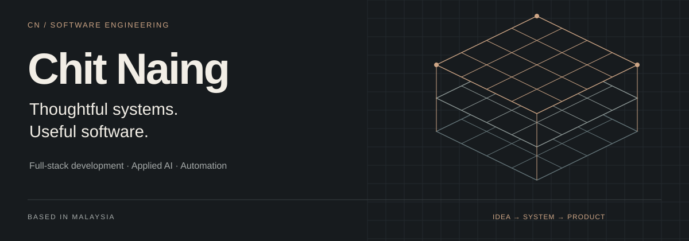
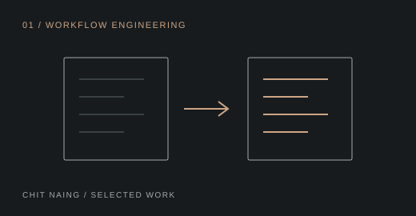
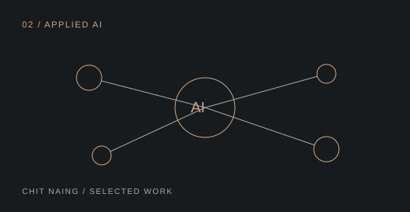
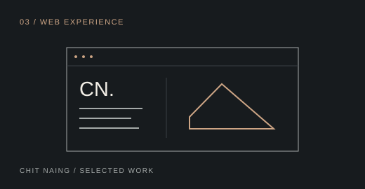
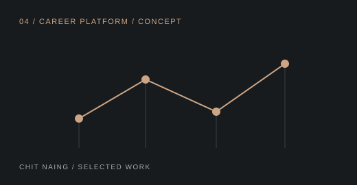
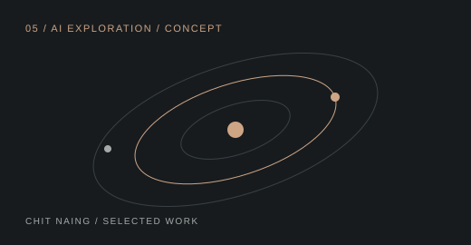

<!-- Upload README.md and assets/ together to Chen-maker-pen/Chen-maker-pen. -->

<a href="https://chit-naing-portfolio.vercel.app/"><strong>Portfolio ↗</strong></a> &nbsp; / &nbsp; <a href="https://drive.google.com/file/d/1e8TVcxnERbwwUgJrHTDnj3TcUw_70IOZ/view?usp=sharing">Résumé ↗</a> &nbsp; / &nbsp; <a href="https://github.com/Chen-maker-pen?tab=repositories">Repositories ↗</a>

I'm **Chit Naing**, a software engineer based in **Malaysia**. I build web applications, automation systems, and practical digital products, with an interest in the architecture that makes them maintainable and the details that make them useful.

My current focus is full-stack development, system design, and AI integration. I'm also exploring mobile development, cloud technologies, open source, and developer tools.

## Selected work

A selection of business applications, product experiences, and career-platform concepts.

<table>
<tr>
<td width="36%"></td>
<td width="64%">
01 / WORKFLOW ENGINEERING
<h3><a href="https://github.com/Chen-maker-pen/chinese-quotation-converter">Chinese Quotation Converter</a></h3>

A business web application for turning Chinese quotation information into a more usable format.

TypeScript · React

<a href="https://github.com/Chen-maker-pen/chinese-quotation-converter"><strong>Explore repository ↗</strong></a>
</td>
</tr>
</table>

<table>
<tr>
<td width="36%"></td>
<td width="64%">
02 / APPLIED AI
<h3><a href="https://github.com/Chen-maker-pen/MOCOF_ai_chatbot">MOCOF AI Chatbot</a></h3>

An AI-powered customer assistance system for discovering products and finding information about home renovation and furniture.

TypeScript · Node.js · AI

<a href="https://github.com/Chen-maker-pen/MOCOF_ai_chatbot"><strong>Explore repository ↗</strong></a>
</td>
</tr>
</table>

<table>
<tr>
<td width="36%"></td>
<td width="64%">
03 / WEB EXPERIENCE
<h3><a href="https://github.com/Chen-maker-pen/Chit-Naing-Portfolio-">Personal Portfolio</a></h3>

A home for my projects, technical skills, experience, and development journey.

TypeScript · React

<a href="https://github.com/Chen-maker-pen/Chit-Naing-Portfolio-"><strong>Explore repository ↗</strong></a> &nbsp; · &nbsp; <a href="https://chit-naing-portfolio.vercel.app/">Visit live site ↗</a>
</td>
</tr>
</table>

<table>
<tr>
<td width="36%"></td>
<td width="64%">
04 / CAREER PLATFORM / CONCEPT
<h3><a href="https://github.com/Chen-maker-pen/nexus">NEXUS</a></h3>

A career platform concept exploring professional journeys beyond the traditional resume.

TypeScript · React

<a href="https://github.com/Chen-maker-pen/nexus"><strong>Explore repository ↗</strong></a>
</td>
</tr>
</table>

<table>
<tr>
<td width="36%"></td>
<td width="64%">
05 / AI EXPLORATION / CONCEPT
<h3><a href="https://github.com/Chen-maker-pen/nexus-ai_future_career_universe">NEXUS AI — Future Career Universe</a></h3>

An exploration of how AI can connect talent, opportunities, and career development.

TypeScript · AI

<a href="https://github.com/Chen-maker-pen/nexus-ai_future_career_universe"><strong>Explore repository ↗</strong></a>
</td>
</tr>
</table>

[Explore all projects →](https://github.com/Chen-maker-pen?tab=repositories)

## Technical toolkit

| Area | Technologies |
| :--- | :--- |
| Languages | TypeScript, JavaScript, Java, Python, C, C# |
| Frontend | React, Next.js, Vue, HTML, CSS |
| Backend & data | Node.js, Express, Firebase, MySQL |
| Tools & platforms | Git, GitHub, Docker, Electron, VS Code |

## How I approach the work

**Understand the problem.** Clarify the need before choosing the technology.

**Design for change.** Keep architecture, usability, and maintainability in view.

**Build, test, improve.** Write readable code, check the behavior, and refine the experience.

---

**Have a look at what I'm building.** [Visit my portfolio ↗](https://chit-naing-portfolio.vercel.app/) · [View my résumé ↗](https://drive.google.com/file/d/1e8TVcxnERbwwUgJrHTDnj3TcUw_70IOZ/view?usp=sharing) · [GitHub ↗](https://github.com/Chen-maker-pen)
